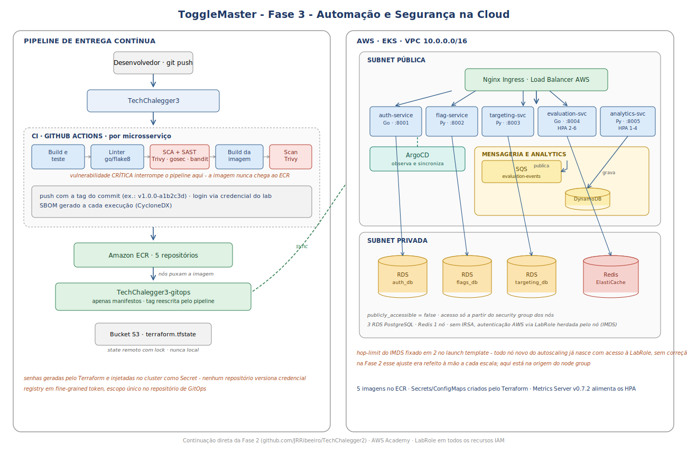

# Relatório Técnico e README - TechChalegger3 (Fase 3 - Automação e Segurança na Cloud)

> Este documento consolida o que foi implementado nesta fase, cobrindo:
> - Infraestrutura como código (Terraform) para o ambiente inteiro da Fase 2
> - Pipeline de CI com DevSecOps: build, lint, SCA, SAST e scan de imagem
> - Entrega contínua via GitOps com ArgoCD
> - Problemas reais encontrados durante o desenvolvimento e como foram resolvidos

---

## 0. Contexto e objetivo

A Fase 2 entregou a arquitetura de microsserviços do ToggleMaster funcionando na AWS, mas de um jeito que não escalava como operação: os 5 serviços eram provisionados por script bash e por clique no console, o deploy era `kubectl apply` direto da máquina de quem estava mexendo, as credenciais de banco viviam em texto plano nos manifestos, e recriar o ambiente de homologação levava dias.

Esta fase reescreve esse ambiente inteiro como código e adiciona duas camadas que a Fase 2 não tinha: segurança automatizada no pipeline e entrega contínua declarativa.

Os 5 microsserviços continuam os mesmos da Fase 2, sem mudança de contrato:

- **auth-service (Go)**: emite e valida API Keys
- **flag-service (Python/Flask)**: CRUD de flags
- **targeting-service (Python/Flask)**: regras de segmentação
- **evaluation-service (Go)**: hot-path de avaliação, cache em Redis, publica eventos na fila
- **analytics-service (Python)**: consome a fila e grava no DynamoDB

No AWS Academy o Terraform não pode criar roles nem policies de IAM. O cluster e os node groups reaproveitam a `LabRole` existente via data source, sem exceção.

---

## 1. Problemas reais encontrados e corrigidos

### 1.1 CVE crítica no compilador usado para buildar o auth-service

**Sintoma:** o Trivy bloqueou o pipeline no estágio de scan da imagem, com severidade CRITICAL.

**Causa raiz:** o Dockerfile compilava com `golang:1.22-alpine`. Essa versão do Go carrega a CVE-2025-68121 no pacote `crypto/tls`, relacionada a validação incorreta de certificado durante resumo de sessão TLS.

**Correção:** imagem base do estágio de build trocada para `golang:1.24-alpine`, que já traz o patch.

### 1.2 CVEs no sistema operacional da imagem base do flag-service

**Sintoma:** mesmo bloqueio de severidade CRITICAL, agora no `flag-service`, apontando para o pacote `perl-base` do Debian.

**Causa raiz:** a imagem `python:3.11-slim` do estágio final não recebia atualização de pacotes do sistema operacional no build, só as dependências Python.

**Correção:** `apt-get update && apt-get upgrade -y` adicionado ao estágio final do Dockerfile, nos três serviços Python.

### 1.3 Bucket de state do Terraform falhando na criação por política do AWS Academy

**Sintoma:** `terraform apply` do bootstrap falhava com `AccessDenied` numa chamada chamada `GetBucketObjectLockConfiguration`, citando uma Service Control Policy explícita.

**Causa raiz:** o provider da AWS, depois de criar o bucket S3, sempre faz uma leitura de verificação de Object Lock como parte do ciclo de vida do recurso. O Academy bloqueia essa chamada específica por SCP, mesmo o bucket já tendo sido criado com sucesso um instante antes.

**Correção:** bucket, versionamento, criptografia e bloqueio de acesso público criados via AWS CLI direto, fora do controle do Terraform. É um recurso criado uma única vez na vida do projeto, então não há motivo para insistir num caminho que a política da conta recusa.

### 1.4 Corrida entre os 5 pipelines paralelos escrevendo no repositório de GitOps

**Sintoma:** o passo final do pipeline (`git push` no repositório de manifestos) falhava com `cannot lock ref 'refs/heads/main'` quando mais de um serviço terminava o build ao mesmo tempo.

**Causa raiz:** os 5 workflows rodam em paralelo e cada um clona, edita e tenta empurrar pro mesmo branch. O primeiro push ganha; os outros chegam com a base desatualizada e o GitHub recusa.

**Correção:** o passo de commit tenta de novo em caso de rejeição, com `git fetch` e `git rebase` antes de repetir o push. Como cada serviço só altera o próprio `deployment.yaml`, nunca há conflito de conteúdo, só de timing.

### 1.5 Apply do Terraform em uma etapa só falha na configuração do provider Kubernetes

**Sintoma:** `terraform apply` direto, sem nenhum recurso ainda criado, falha ao configurar o provider Kubernetes.

**Causa raiz:** o endpoint e o certificado do cluster, usados para autenticar o provider Kubernetes, são atributos do cluster EKS que este mesmo apply ainda vai criar. O Terraform não consegue planejar um provider cuja configuração depende de um recurso do mesmo plano.

**Correção:** apply em duas etapas. `terraform apply -target=module.eks` primeiro, depois `terraform apply` sem alvo para o restante.

### 1.6 Hop-limit do IMDS, resolvido na origem

Na Fase 2 os pods não alcançavam o metadata service da instância porque o limite de saltos vinha em 1 por padrão, e cada nó novo criado pelo autoscaling nascia com o mesmo problema, exigindo correção manual repetida.

Aqui o launch template dos nós fixa `http_put_response_hop_limit = 2` na origem. Todo nó que o Kubernetes cria a partir de agora já nasce com acesso à LabRole via IMDS, sem intervenção depois do fato.

---

## 2. Arquitetura



Fluxo de entrega, do commit ao cluster:

```
[ Desenvolvedor ]
      |  git push
      v
[ TechChalegger3 ]
      |
      v
[ CI: build -> lint -> SCA/SAST -> build da imagem -> scan Trivy ]
      |  (CRITICAL bloqueia aqui)
      v
[ Amazon ECR ]
      |  pipeline reescreve a tag
      v
[ TechChalegger3-gitops ]  <-- só manifestos, nenhuma credencial
      |  ArgoCD observa e sincroniza
      v
[ Cluster EKS: 5 microsserviços + ArgoCD + Ingress ]
      |
      v
[ RDS x3 (privado) | Redis (privado) | SQS | DynamoDB ]
```

---

## 3. Infraestrutura como Código

Terraform modular: `network`, `eks`, `data-stores` e `ecr`, amarrados pela raiz do projeto.

Decisões que valem registrar:

- **Bancos fora da internet.** Na Fase 2 os RDS subiam com `publicly_accessible = true`. Aqui vivem em subnet privada e só aceitam conexão do security group dos nós do cluster.
- **Senha nunca em arquivo.** As senhas nascem de `random_password`, ficam só no state remoto e chegam ao cluster como Secret criado pelo próprio Terraform. Nem este repositório nem o de GitOps versionam credencial.
- **State remoto com lock.** Backend S3 com `use_lockfile`, disponível a partir do Terraform 1.10.
- **NAT desligado por padrão.** Custa por hora, e o crédito do Academy é curto. Os nós ficam em subnet pública (para puxar imagem do ECR) e só os bancos ficam privados. Uma variável liga o NAT e migra os nós para privado quando fizer sentido.

```bash
cd terraform/bootstrap && terraform apply    # bucket do state, uma vez na vida
cd ../
terraform apply -target=module.eks           # cluster primeiro
terraform apply                              # o restante
```

---

## 4. Pipeline DevSecOps e GitOps

Um workflow reutilizável (`ci-reusable.yml`) chamado pelos 5 workflows específicos, cada um filtrando por caminho para não disparar os outros quatro à toa.

Estágios: build e teste, lint (golangci-lint ou flake8), SCA e SAST (Trivy em modo filesystem, gosec ou bandit), build e scan da imagem (Trivy em modo image), push com a tag do commit, e o passo de GitOps que reescreve a tag no repositório de manifestos.

A regra de bloqueio não é teórica: duas vulnerabilidades críticas reais pararam o pipeline durante o desenvolvimento desta fase, documentadas na seção 1.

O deploy nunca é feito pelo pipeline. Quem aplica no cluster é o ArgoCD, observando o repositório `TechChalegger3-gitops`, que contém só Deployment, Service, HPA e Ingress. Nenhum Secret, nenhum ConfigMap: esses nascem do Terraform, direto no cluster.

---

## 5. Retomando o lab (AWS Academy)

A cada **Start Lab**, a credencial expira e precisa ser renovada em dois lugares.

1. Colar a credencial nova em `~/.aws/credentials`.
2. Atualizar os secrets `AWS_ACCESS_KEY_ID`, `AWS_SECRET_ACCESS_KEY` e `AWS_SESSION_TOKEN` no GitHub, senão o pipeline para de conseguir logar no ECR.
3. Validar:

```bash
aws sts get-caller-identity
kubectl get nodes                          # aguardar Ready
kubectl get pods -n techchallenger         # aguardar todos 1/1
kubectl get applications -n argocd         # aguardar Synced
curl -i http://<load-balancer>/auth/health # esperado: 200
```

Testado e validado: `{"status":"ok"}` respondido pelo Ingress, atravessando o Load Balancer até o `auth-service`.

---

## 6. Segurança aplicada

- Vulnerabilidade CRITICAL em dependência (SCA) ou na imagem final (scan de container) interrompe o pipeline antes do push ao ECR.
- Código-fonte analisado estaticamente por linguagem: `gosec` nos serviços Go, `bandit` nos serviços Python.
- SBOM gerado a cada execução, formato CycloneDX.
- Nenhuma credencial em repositório, nem no de código nem no de manifestos. Secrets nascem no Terraform e são injetados direto no cluster.
- Imagens com tag imutável no ECR, identificadas pelo hash do commit, nunca `latest`.

---

## 7. Estado final

- Cluster EKS ativo, 2 nós `Ready`, 5 microsserviços `Running`.
- Os 6 `Applications` do ArgoCD (5 serviços + Ingress) sincronizados com o repositório de GitOps.
- Fluxo ponta a ponta validado: push no código dispara o pipeline, imagem publicada no ECR com tag do commit, tag reescrita no repositório de manifestos, ArgoCD sincroniza sozinho, sem `kubectl apply` manual em nenhum momento.
- Duas vulnerabilidades críticas reais, encontradas pelo próprio pipeline durante o desenvolvimento e corrigidas antes da entrega.

Continuação direta da [Fase 2](https://github.com/JRRibeeiro/TechChalegger2). Repositório de manifestos: [TechChalegger3-gitops](https://github.com/JRRibeeiro/TechChalegger3-gitops).
