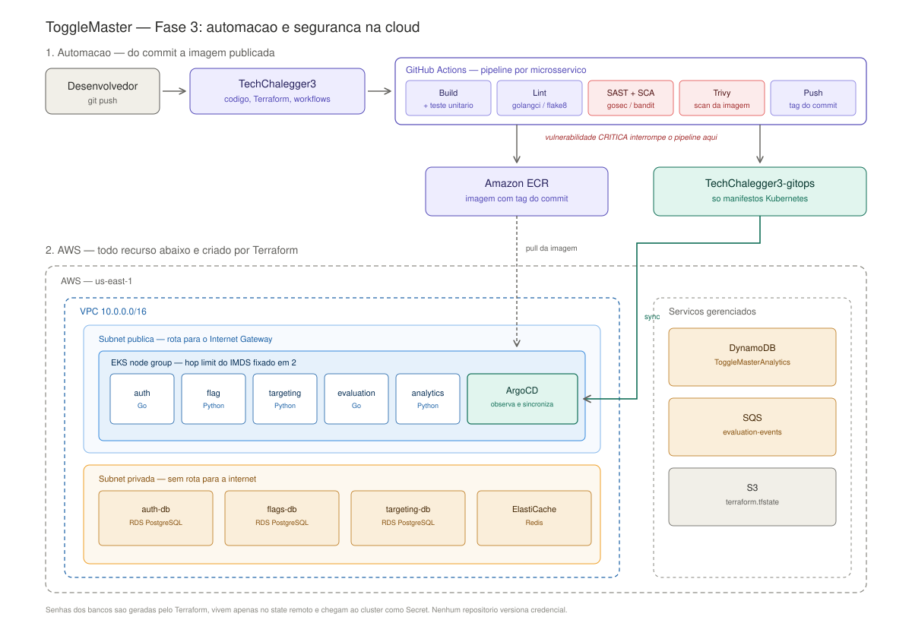

# ToggleMaster — Fase 3: Automação e Segurança na Cloud

Terceira fase do Tech Challenge da pós-graduação em DevOps & Arquitetura Cloud (FIAP). Reescreve a infraestrutura da [Fase 2](https://github.com/JRRibeeiro/TechChalegger2) — um sistema de feature flags com 5 microsserviços na AWS — como Infraestrutura como Código, com pipelines DevSecOps e deploy via GitOps.

## O problema

A Fase 2 funcionava, mas o ambiente tinha nascido de scripts bash e cliques no console. Recriar homologação levava dias. As senhas dos bancos estavam versionadas em texto plano. Os bancos tinham acesso público. Não existia pipeline de CI/CD.

## O que mudou

- **Infraestrutura como Código** — VPC, EKS, 3 RDS PostgreSQL, ElastiCache Redis, DynamoDB, SQS e 5 repositórios ECR, tudo em Terraform modular. State remoto em S3 com lock.
- **Bancos fora da internet** — RDS e Redis migrados para subnet privada, aceitando conexão apenas dos nós do cluster.
- **Segredos fora do código** — senhas geradas em runtime pelo Terraform e injetadas no cluster como Secret. Nenhum repositório versiona credencial.
- **Pipeline DevSecOps por microsserviço** — build, lint, SCA e SAST, com vulnerabilidade crítica bloqueando o pipeline antes de qualquer imagem chegar ao registry.
- **GitOps com ArgoCD** — o pipeline nunca faz deploy diretamente; ele atualiza a tag da imagem no [repositório de manifestos](https://github.com/JRRibeeiro/TechChalegger3-gitops), e o ArgoCD sincroniza o cluster a partir dali.

## Arquitetura



## Vulnerabilidades reais encontradas e corrigidas

O pipeline de segurança não é decorativo — bloqueou duas vulnerabilidades críticas reais durante o desenvolvimento:

| Serviço | CVE | Causa | Correção |
|---|---|---|---|
| auth-service | CVE-2025-68121 | `crypto/tls` desatualizado no Go 1.22 | imagem base atualizada para Go 1.24 |
| flag-service | CVE-2026-13221 e outras 2 | pacotes Debian desatualizados na imagem base | `apt-get upgrade` no build da imagem |

## Stack

Terraform · AWS (EKS, RDS, ElastiCache, DynamoDB, SQS, ECR, S3) · GitHub Actions · Trivy · gosec/bandit · ArgoCD · Kubernetes

## Estrutura

```
terraform/       infraestrutura modular (network, eks, data-stores, ecr)
.github/workflows/  pipeline reutilizável + 5 workflows por serviço
argocd/           Applications do ArgoCD
services/         código-fonte dos 5 microsserviços
docs/             diagrama de arquitetura
```

## Restrição do ambiente

Desenvolvido em AWS Academy: o Terraform não cria roles de IAM, reaproveitando a `LabRole` existente via data source.
